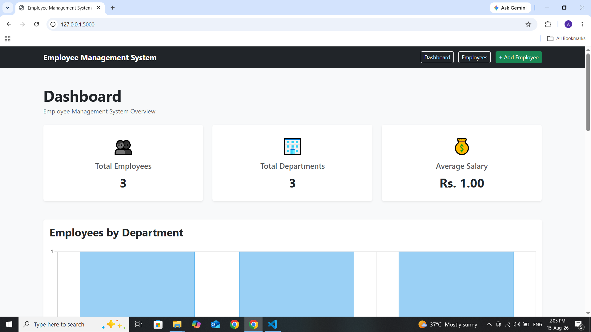
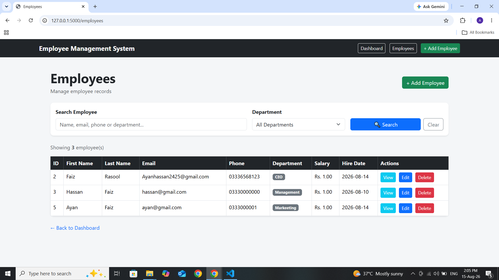
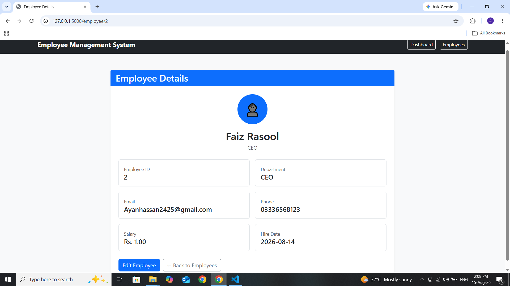
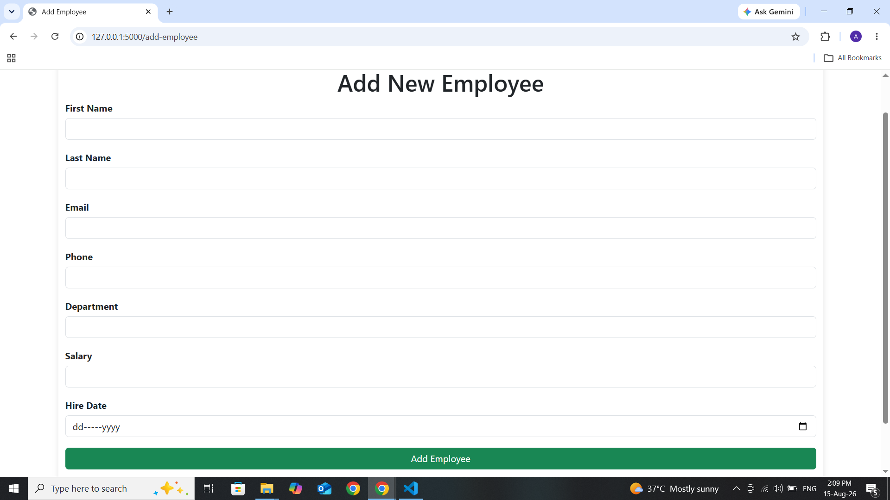
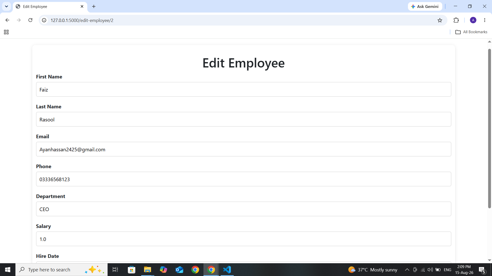

Employee Management System

A professional Employee Management System built with **Python, Flask, Oracle Database, HTML, CSS, Bootstrap, and Chart.js**.

This application provides complete employee management functionality along with a dynamic dashboard, advanced search, filtering, pagination, employee analytics, and salary statistics.

---

📌 Project Overview

The Employee Management System is a web-based application designed to manage employee records efficiently.

It allows users to:

- Add employees
- View employees
- View employee details
- Edit employee information
- Delete employees
- Search employees
- Filter employees by department
- Navigate employees using pagination
- View dashboard statistics
- Analyze employees by department
- Analyze salary distribution

The application uses **Oracle Database** as the backend database and **Flask** as the web framework.

---

✨ Features

👨‍💼 Employee Management

- Add new employees
- View employee list
- View detailed employee profile
- Edit employee information
- Delete employees
- Duplicate email protection
- Backend validation

🔎 Search & Filtering

- Search by first name
- Search by last name
- Search by email
- Search by phone
- Search by department
- Department filtering
- Clear search functionality

📄 Pagination

- 10 employees per page
- Previous / Next navigation
- Page numbers
- Pagination works with search and department filters

📊 Dashboard

The dashboard provides real-time statistics including:

- Total Employees
- Total Departments
- Average Salary
- Highest Salary
- Lowest Salary

📈 Analytics

- Employees by Department chart
- Salary Distribution chart
- Recent Employees table
- Quick access to employee details

---

🛠️ Technologies Used

Backend

- Python
- Flask
- python-oracledb
- python-dotenv

Frontend

- HTML5
- CSS3
- Bootstrap 5
- JavaScript
- Chart.js

Database
- Oracle Database 11g

Development Tools
- Visual Studio Code
- Git
- GitHub
- Python Virtual Environment

---

📁 Project Structure
employee-management-system/
│
├── app.py
├── requirements.txt
├── .gitignore
├── .env.example
├── README.md
│
├── database/
│   ├── db.py
│   └── test_connection.py
│
├── templates/
│   ├── index.html
│   ├── employees.html
│   ├── add_employee.html
│   ├── edit_employee.html
│   └── employee_details.html
│
└── .venv/

⚙️ Installation

1. Clone the repository
git clone https://github.com/FaizRasool-dev/employee-management-system.git

2. Open the project
cd employee-management-system

3. Create a virtual environment
python -m venv .venv

4. Activate the virtual environment
Windows PowerShell:
.venv\Scripts\Activate.ps1

5. Install dependencies
pip install -r requirements.txt

🔐 Environment Variables
Create a .env file in the project root.
Example:
ORACLE_USERNAME=your_username
ORACLE_PASSWORD=your_password
ORACLE_DSN=your_dsn

⚠️ Important: 
Never upload your real .env file or database password to GitHub.
The .env file should remain inside .gitignore.

🗄️ Oracle Database
This project uses Oracle Database 11g.
Make sure Oracle Database is running and the required EMPLOYEES table exists.
The application connects to Oracle using:
- oracledb.connect()
Oracle Instant Client is used for the database connection.

▶️ Run the Application
Activate the virtual environment:
.venv\Scripts\Activate.ps1
Then start Flask:
python app.py
Open your browser:
http://127.0.0.1:5000

📊 Dashboard
The dashboard displays:
Total Employees
Total Departments
Average Salary
Highest Salary
Lowest Salary

📊 It also provides visual analytics for:
Department-wise employees
Salary distribution
Recent employees

👤 Employee Operations
Each employee supports:
View
Edit
Delete

👤 The employee details page displays:
Employee ID
First Name
Last Name
Email
Phone
Department
Salary
Hire Date

🔎 Search
Employees can be searched using:
First Name
Last Name
Email
Phone
Department
Search results can also be combined with department filtering and pagination.

🛡️ Validation
The application includes backend validation for:
Required employee names
Minimum name length
Email format
Salary validation
Hire date validation
Duplicate email protection

📈 Analytics
Employees by Department
A dynamic bar chart displays the number of employees in each department.
Salary Distribution
Employees are grouped into salary ranges:
Below 50K
50K - 99K
100K - 199K
200K+

🚀 Future Improvements
Possible future enhancements include:
User authentication
Role-based access control
Employee profile pictures
Export employees to Excel
Export reports to PDF
Advanced salary reports
Attendance management
Leave management
Email notifications
REST API
Cloud deployment

🔒 Security Notes
Database credentials are stored in environment variables.
.env should never be committed to GitHub.
Input validation is performed on the backend.
Database queries use parameterized values.

👨‍💻 Author
Faiz Rasool
GitHub:
https://github.com/FaizRasool-dev

📄 License
This project is created for portfolio and demonstration purposes.

📸 Project Screenshots

📊 Dashboard

👥 Employees

👤 Employee Details

➕ Add Employee

✏️ Edit Employee

